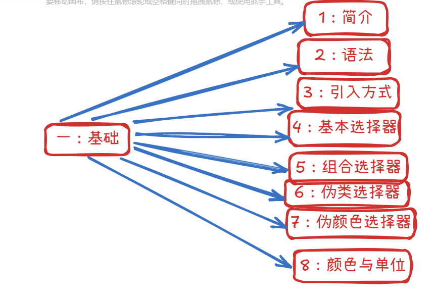
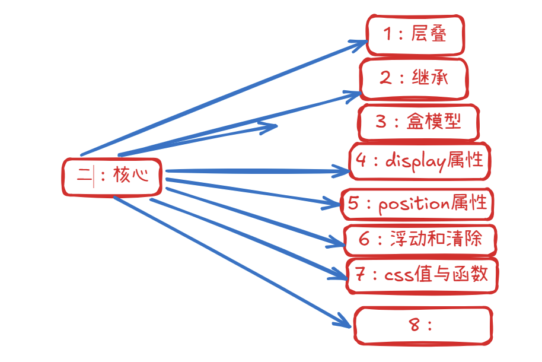
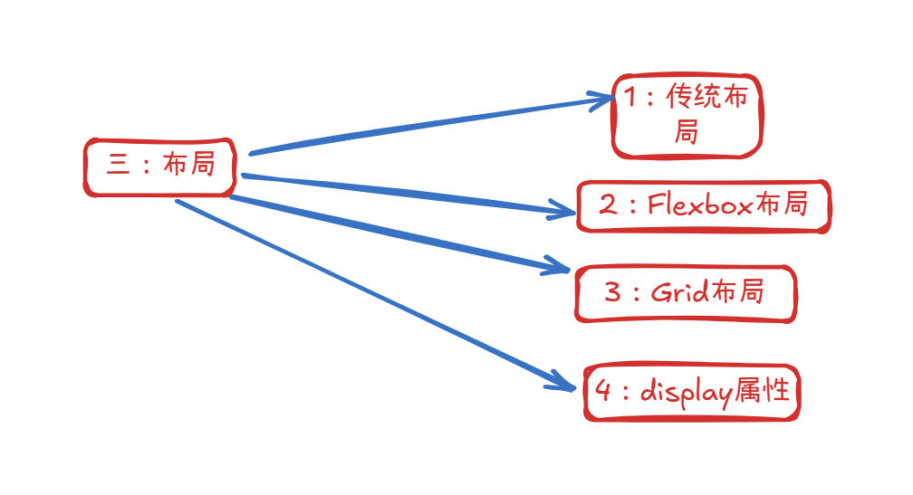
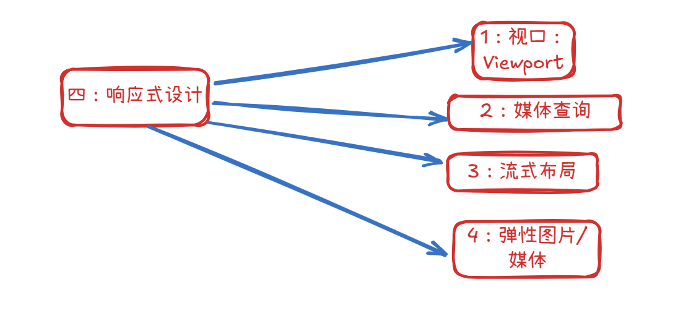
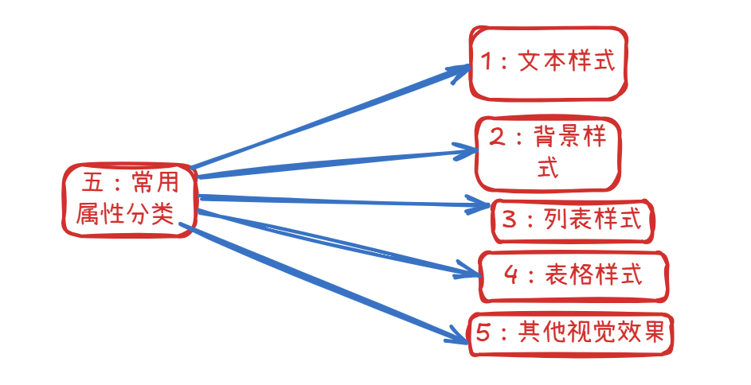
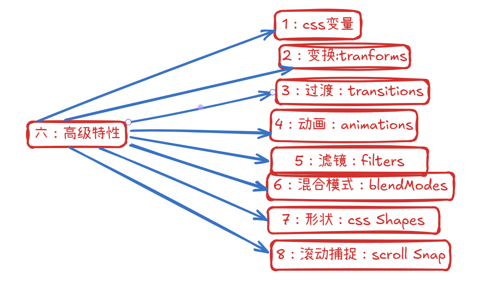
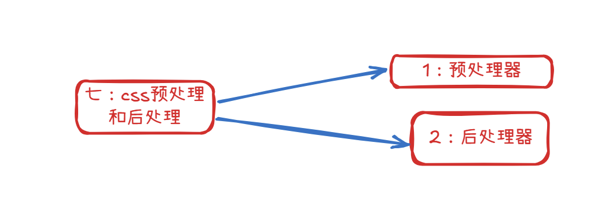

### **1. 文档结构标签**
用于定义网页的基本结构和层次关系。
- **`<html>`**：根标签，包裹整个HTML文档。
- **`<head>`**：包含文档元数据（如字符编码、页面标题、引用资源等）。
- **`<body>`**：包含可见的页面内容（文本、图像、链接等）。
- **`<title>`**：定义浏览器标签页或书签中的页面标题。
- **`<meta>`**：提供关于HTML文档的元数据（如字符编码、关键词、描述）。

### **2. 文本格式化标签**
用于定义文本的结构和格式。
- **标题标签**：`<h1>`~`<h6>`（定义不同级别的标题）。
- **段落标签**：`<p>`（定义段落）。
- **文本样式标签**：
  - `<b>`（粗体）、`<i>`（斜体）、`<u>`（下划线）。
  - `<strong>`（强调重要性）、`<em>`（强调语气）。
  - `<small>`（小号文本）、`<mark>`（高亮文本）。
- **列表标签**：
  - 无序列表：`<ul>` + `<li>`（如项目符号列表）。
  - 有序列表：`<ol>` + `<li>`（如数字列表）。
  - 定义列表：`<dl>` + `<dt>`（术语） + `<dd>`（定义）。

### **3. 链接和媒体标签**
用于嵌入外部资源或创建导航链接。
- **链接标签**：`<a>`（定义超链接）。
  ```html
  <a href="https://example.com">访问网站</a>
  ```
- **图像标签**：``（插入图片）。
  ```html
  
  ```
- **多媒体标签**：
  - `<audio>`（嵌入音频）。
  - `<video>`（嵌入视频）。
  - `<iframe>`（嵌入外部网页）。

### **4. 表格标签**
用于展示结构化数据。
- `<table>`（表格容器）
- `<tr>`（表格行）
- `<th>`（表头单元格）
- `<td>`（表格数据单元格）
- `<caption>`（表格标题）
- `<thead>`、`<tbody>`、`<tfoot>`（表格分区）


### **5. 表单标签**
用于用户输入和数据提交。
- `<form>`（表单容器）
- `<input>`（输入字段，类型包括`text`、`password`、`radio`、`checkbox`等）
- `<select>`（下拉选择框）
- `<textarea>`（多行文本输入）
- `<button>`（按钮）
- `<label>`（为输入元素定义标签）
- `<fieldset>`和`<legend>`（表单分组）

### **6. 语义化标签**
用于明确页面结构和内容含义，提升SEO和可访问性。
- `<header>`（页面或章节的头部）
- `<nav>`（导航链接区域）
- `<main>`（页面主要内容）
- `<article>`（独立内容，如博客文章）
- `<section>`（文档中的章节）
- `<aside>`（侧边栏或辅助内容）
- `<footer>`（页面或章节的底部）

### **7. 容器标签**
用于组织和布局页面元素。
- `<div>`（通用块级容器）
- `<span>`（通用内联容器）
- `<br>`（换行）
- `<hr>`（水平线）
- `<pre>`（保留格式的文本）

### **8. 交互元素标签**
用于创建交互式组件。
- `<details>`和`<summary>`（可折叠内容）
- `<dialog>`（对话框）
- `<progress>`（进度条）
- `<meter>`（刻度值指示器）

### **9. 脚本和样式标签**
用于嵌入或引用外部资源。
- `<script>`（JavaScript代码或引用）
- `<style>`（内联CSS样式）
- `<link>`（引用外部资源，如CSS文件）
- `<meta>`（定义字符编码、页面描述等）

### **10. 其他特殊标签**
- `<canvas>`（用于图形绘制的HTML5元素）
- `<svg>`（可缩放矢量图形）
- `<template>`（HTML模板）
- `<datalist>`（为输入字段提供预定义选项）
- `<keygen>`（生成密钥对）


# css


**CSS (层叠样式表) 知识图谱**

# **一、基础 (Basics)**



1. **简介 (Introduction)**

- CSS 是什么？(What is CSS?)
- CSS 的作用 (Purpose of CSS: 分离内容与表现)
- CSS 历史与版本 (History and Versions: CSS1, CSS2.1, CSS3+)

2. **语法 (Syntax)**

- 规则集 (Rule Set): 选择器 { 属性: 值; }
- 声明 (Declaration): property: value
- 注释 (Comments): /_ comment _/

3. **引入方式 (Linking Methods)**

- 外部样式表 (External Stylesheet): `<link rel="stylesheet" href="style.css">  `
- 内部样式表 (Internal Stylesheet): `<style>` 标签
- 内联样式 (Inline Styles): style 属性

4. **基本选择器 (Basic Selectors)**

- 元素选择器 (Element Selector): p, div, h1
- 类选择器 (Class Selector): .classname
- ID 选择器 (ID Selector): #idname
- 通用选择器 (Universal Selector): \*
- 属性选择器 (Attribute Selectors):
- `[attr]  ` 存在该属性
- `[attr=value]  ` 属性值完全等于value
- `[attr~=value]  `属性值是空格分隔符的单词列表，其中一个单词是value
- `[attr|=value]  ` 属性值等于value或者以value-开头
- `[attr^=value]  `属性值以value开头
- `[attr$=value]  `属性值以value结尾
- `[attr*=value]  `属性值包含value

5. **组合选择器 (Combinators)**

- 后代选择器 (Descendant Combinator): A B
- 子代选择器 (Child Combinator): A > B
- 相邻兄弟选择器 (Adjacent Sibling Combinator): A + B
- 通用兄弟选择器 (General Sibling Combinator): A ~ B

6. **伪类选择器 (Pseudo-classes)**

- 链接伪类: :link, :visited
- 用户行为伪类: :hover, :active, :focus
- UI 元素状态伪类: :enabled, :disabled, :checked, :indeterminate
- 结构性伪类:
- :root
- :first-child, :last-child
- :nth-child(n), :nth-last-child(n)
- :nth-of-type(n), :nth-last-of-type(n)
- :first-of-type, :last-of-type
- :only-child, :only-of-type
- :empty
- 目标伪类: :target
- 否定伪类: :not(selector)
- 语言伪类: :lang(language)

7. **伪元素选择器 (Pseudo-elements)**

- ::before
- ::after
- ::first-letter
- ::first-line
- ::selection
- ::marker (用于列表项)
- ::placeholder (用于表单输入)

8. **颜色与单位 (Colors & Units)**

- 颜色值 (Color Values): 命名颜色, HEX, RGB, RGBA, HSL, HSLA
- 长度单位 (Length Units):
- 绝对单位: px, pt, cm, mm, in
- 相对单位: em, rem, %, vw, vh, vmin, vmax
- 其他单位: 角度 (deg, rad,turn, grad(它将一个圆周分为 400 个等份)), 时间 (s, ms) 

# **二、核心概念 (Core Concepts)**




1. **层叠 (Cascade)**

- 来源 (Origin): 作者样式表, 用户样式表, 浏览器默认样式表
- 重要性 (Importance): !important
- 特异性/优先级 (Specificity): ID > 类/属性/伪类 > 元素/伪元素 > 通用
- 顺序 (Order): 后声明的覆盖先声明的

2. **继承 (Inheritance)**

- 哪些属性可继承 (e.g., color, font-family)
- 强制继承: inherit
- 重置继承: initial, unset

3. **盒模型 (Box Model)**

- content (内容)
- padding (内边距)
- border (边框)
- margin (外边距)
- box-sizing: content-box (默认), border-box

4. **display 属性 (Display Property)**

- block (块级)
- inline (行内)
- inline-block (行内块)
- none (隐藏)
- flex (弹性布局)
- grid (网格布局)
- table, table-row, table-cell (表格布局)
- list-item (列表项)

5. **position 属性 (Position Property)**

- static (默认)
- relative (相对定位)
- absolute (绝对定位)
- fixed (固定定位)
- sticky (粘性定位)
- top, right, bottom, left
- z-index (层叠顺序)

6. **浮动与清除 (Floats & Clearing)**

- float: left, right, none
- clear: left, right, both, none
- 清除浮动的方法 (Clearing Floats): 空 div, overflow: hidden/auto, 伪元素方法

7. **CSS 值与函数 (CSS Values & Functions)**

- calc() (计算)
- var() (自定义属性/变量)
- attr() (获取属性值)
- url() (引用资源)
- 颜色函数: rgb(), rgba(), hsl(), hsla()
- 数学函数: min(), max(), clamp()


# **三、布局 (Layout)**




1. **传统布局 (Traditional Layout)**

- 基于 display, position, float

2. **Flexbox 弹性布局 (Flexible Box Layout)**

- 容器属性 (Container Properties):
- display: flex | inline-flex
- flex-direction: row, row-reverse, column, column-reverse
- flex-wrap: nowrap, wrap, wrap-reverse
- flex-flow: (flex-direction 和 flex-wrap 的简写)
- justify-content: flex-start, flex-end, center, space-between, space-around, space-evenly
- align-items: stretch, flex-start, flex-end, center, baseline
- align-content: (多行/列内容对齐) flex-start, flex-end, center, space-between, space-around, stretch
- 项目属性 (Item Properties):
- order
- flex-grow
- flex-shrink
- flex-basis
- flex: (flex-grow, flex-shrink, flex-basis 的简写)
- align-self

3. **Grid 网格布局 (Grid Layout)**

- 容器属性 (Container Properties):
- display: grid | inline-grid
- grid-template-columns, grid-template-rows
- grid-template-areas
- grid-template: (简写)
- column-gap (或 grid-column-gap), row-gap (或 grid-row-gap), gap (或 grid-gap)
- justify-items, align-items
- justify-content, align-content (当网格总大小小于其网格容器时)
- grid-auto-columns, grid-auto-rows
- grid-auto-flow
- 项目属性 (Item Properties):
- grid-column-start, grid-column-end, grid-column
- grid-row-start, grid-row-end, grid-row
- grid-area
- justify-self, align-self

4. **多列布局 (Multi-column Layout)**

- column-count
- column-width
- columns (简写)
- column-gap
- column-rule
- column-span
- break-before, break-after, break-inside

# **四、响应式设计 (Responsive Web Design - RWD)**




1. **视口 (Viewport)**

- `<meta name="viewport" content="width=device-width, initial-scale=1.0">`

2. **媒体查询 (Media Queries)**

- @media 规则
- 媒体类型 (Media Types): all, print, screen, speech
- 媒体特性 (Media Features): width, height, aspect-ratio, orientation, resolution, hover, pointer

3. **流式布局 (Fluid Layouts)**

- 使用百分比和相对单位

4. **弹性图片/媒体 (Flexible Images/Media)**

- max-width: 100%, height: auto
- `<picture>` 元素, srcset 属性

# **五、常用属性分类 (Common Properties by Category)**




1. **文本样式 (Text Styling)**

- font-family, font-size, font-weight, font-style, font-variant
- line-height
- text-align, text-decoration, text-transform, text-indent, letter-spacing, word-spacing
- white-space, text-overflow, word-break, overflow-wrap
- color

2. **背景样式 (Background Styling)**

- background-color
- background-image
- background-repeat
- background-position
- background-attachment
- background-size
- background-clip, background-origin
- background (简写)

3. **列表样式 (List Styling)**

- list-style-type
- list-style-image
- list-style-position
- list-style (简写)

4. **表格样式 (Table Styling)**

- border-collapse, border-spacing
- caption-side, empty-cells
- table-layout

5. **其他视觉效果 (Other Visual Effects)**

- opacity (透明度)
- visibility (可见性)
- cursor (鼠标指针)
- box-shadow (盒子阴影)
- text-shadow (文本阴影)
- border-radius (圆角)
- outline (轮廓)

# **六、高级特性 (Advanced Features)**




1. **CSS 变量 (Custom Properties)**

- 声明: --variable-name: value;
- 使用: var(--variable-name, fallback_value)
- 作用域 (Scoping)

2. **变换 (Transforms)**

- transform: translate(), rotate(), scale(), skew(), matrix()
- transform-origin
- perspective
- 2D 与 3D 变换

3. **过渡 (Transitions)**

- transition-property
- transition-duration
- transition-timing-function
- transition-delay
- transition (简写)

4. **动画 (Animations)**

- @keyframes 规则
- animation-name
- animation-duration
- animation-timing-function
- animation-delay
- animation-iteration-count
- animation-direction
- animation-fill-mode
- animation-play-state
- animation (简写)

5. **滤镜 (Filters)**

- filter: blur(), brightness(), contrast(), grayscale(), hue-rotate(), invert(), opacity(), saturate(), sepia(), drop-shadow()

6. **混合模式 (Blend Modes)**

- mix-blend-mode (元素间混合)
- background-blend-mode (背景层间混合)

7. **CSS Shapes (形状)**

- shape-outside
- shape-margin
- shape-image-threshold

8. **滚动捕捉 (Scroll Snap)**

- scroll-snap-type
- scroll-snap-align
- scroll-padding, scroll-margin

9. **书写模式 (Writing Modes)**

- writing-mode
- 逻辑属性 (Logical Properties): margin-block-start, padding-inline-end, etc.

# **七、CSS 预处理器与后处理器 (Preprocessors & Postprocessors)**




1. **预处理器 (Preprocessors): Sass/SCSS, Less, Stylus**

- 变量 (Variables)
- 嵌套 (Nesting)
- 混合 (Mixins)
- 继承 (@extend)
- 函数 (Functions)
- 模块化 (@import, @use, @forward - Sass)

2. **后处理器 (Postprocessors): PostCSS**

- Autoprefixer (自动添加浏览器前缀)
- CSS Modules
- Linters (Stylelint)
- Minifiers (CSSNano)

# **八、CSS 架构与方法论 (Architecture `&` Methodologies)**

1. **OOCSS (Object-Oriented CSS)**
2. **SMACSS (Scalable and Modular Architecture for CSS)**
3. **BEM (Block, Element, Modifier)**
4. **Atomic CSS / Utility-First CSS (e.g., Tailwind CSS)**
5. **ITCSS (Inverted Triangle CSS)**

# **九、CSS 框架与库 (Frameworks & Libraries)**

1. **UI 框架 (UI Frameworks): Bootstrap, Foundation, Bulma, Materialize**
2. **功能优先框架 (Utility-First Frameworks): Tailwind CSS**
3. **CSS-in-JS: Styled Components, Emotion**

# **十、性能优化与最佳实践 (Performance & Best Practices)**

1. **减少 HTTP 请求 (Reduce HTTP Requests)**

- 合并文件 (Concatenation)

2. **压缩 CSS (Minify CSS)**
3. **使用 CDN (Use CDN)**
4. **避免使用 @import (Avoid @import)**
5. **优化选择器性能 (Optimize Selector Performance)**

- 避免深层嵌套, 避免通用选择器作为键选择器

6. **减少重绘与回流 (Reduce Repaints & Reflows)**

- 使用 transform 和 opacity 进行动画
- 避免频繁改变布局相关属性

7. **代码组织与可维护性 (Code Organization & Maintainability)**
8. **可访问性 (Accessibility - A11y)**

- 颜色对比度, :focus 样式, ARIA 属性配合

9. **浏览器兼容性 (Browser Compatibility)**

- 使用 Can I Use 查看支持情况
- 渐进增强与优雅降级

10. **代码检查 (Linting)**

- Stylelint

11. **Reset CSS / Normalize CSS**

# **十一、CSS 新特性与未来趋势 (New Features & Future Trends)**

1. **容器查询 (Container Queries): @container**
2. **级联层 (@layer)**
3. **作用域 CSS (@scope - 实验性)**
4. **新的颜色空间与函数: lch(), oklch(), color-mix(), color-contrast()**
5. **CSS Houdini (提供底层 API，允许开发者扩展 CSS)**
6. **嵌套选择器 (Nesting Selectors - 原生支持)**
7. **滚动驱动动画 (Scroll-driven Animations)**
8. **三角函数: sin(), cos(), tan(), etc.**
9. **视图过渡 API (View Transitions API)**

# flex 布局


保护皮肤

1. 减少高升糖指数 (GI) 食物：

避免或减少摄入： 白米饭、白面包、面条、糖果、甜点、含糖饮料等。这些食物会导致血糖快速升高，刺激胰岛素分泌，进而可能增加皮脂分泌，加重痘痘和黑头。
选择低升糖指数食物： 全谷物（糙米、燕麦）、蔬菜、水果（低糖的如莓类、苹果）、豆类等，这些食物血糖升高缓慢，有助于稳定血糖和皮脂分泌。
2. 减少乳制品摄入 (部分人可能敏感)：

观察反应： 一些研究表明，乳制品中的某些成分可能与痘痘的发生有关。你可以尝试减少乳制品的摄入，观察皮肤是否有改善。
替代选择： 可以尝试植物奶（杏仁奶、豆奶、燕麦奶）作为替代品。
3. 减少高脂肪和油炸食物：

避免或减少摄入： 油炸食品、肥肉、动物内脏等。这些食物可能增加皮脂分泌，并可能导致身体炎症，不利于痘痘和痘印的恢复。
选择健康的脂肪来源： 鱼类（富含Omega-3脂肪酸）、坚果、鳄梨、橄榄油等，这些健康的脂肪对皮肤有益。
4. 增加 Omega-3 脂肪酸的摄入：

食物来源： 深海鱼（三文鱼、金枪鱼、沙丁鱼）、亚麻籽、奇亚籽、核桃等。Omega-3 脂肪酸具有抗炎作用，有助于减轻痘痘炎症，并对皮肤屏障功能有益。
5. 增加富含抗氧化剂的食物：

食物来源： 各种颜色的水果和蔬菜（蓝莓、草莓、菠菜、西兰花等）、绿茶等。抗氧化剂可以帮助抵抗自由基的损害，促进皮肤修复，减少炎症。
6. 增加富含锌的食物：

食物来源： 海鲜、瘦肉、坚果、种子、豆类等。锌具有抗炎和调节皮脂分泌的作用，对痘痘和皮肤健康有益。
7. 增加富含维生素 A 的食物：

食物来源： 胡萝卜、红薯、菠菜、肝脏等。维生素 A 对皮肤细胞的正常代谢很重要。
8. 保持充足的水分摄入：

饮用足够的水： 水是保持皮肤水润的基础，有助于皮肤的新陈代谢和废物排出。
9. 注意食物过敏和不耐受：

观察记录： 留意自己的饮食和皮肤反应，有些人的痘痘可能与特定的食物过敏或不耐受有关。
简单易行的饮食建议：

多吃蔬菜和水果： 每天确保摄入足够量的各种蔬菜和水果。
选择全谷物： 用全谷物代替部分精制谷物。
适量摄入优质蛋白质： 选择鱼、瘦肉、豆类等。
选择健康的脂肪： 用健康的脂肪代替不健康的脂肪。
限制加工食品和高糖食物： 尽量减少零食、快餐和含糖饮料的摄入。
多喝水： 保持每天充足的饮水量。