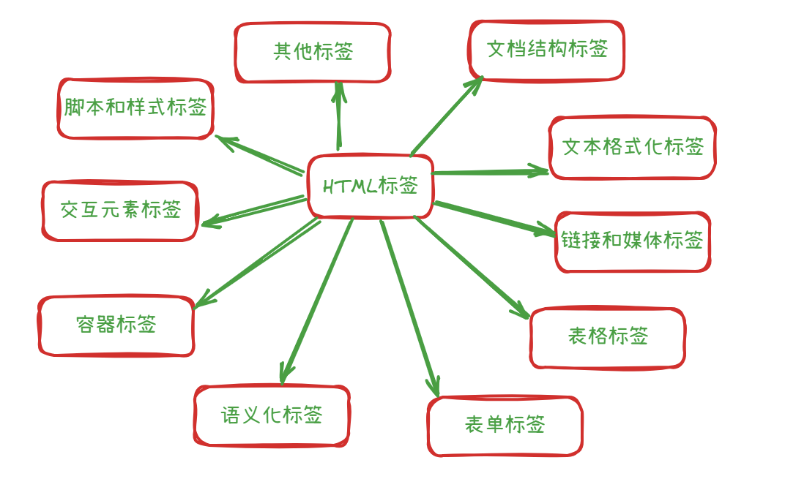

# html 大全



### **1. 文档结构标签**

用于定义网页的基本结构和层次关系。

- **`<html>`**：根标签，包裹整个 HTML 文档。
- **`<head>`**：包含文档元数据（如字符编码、页面标题、引用资源等）。
- **`<body>`**：包含可见的页面内容（文本、图像、链接等）。
- **`<title>`**：定义浏览器标签页或书签中的页面标题。
- **`<meta>`**：提供关于 HTML 文档的元数据（如字符编码、关键词、描述）。

### **2. 文本格式化标签**

用于定义文本的结构和格式。

- **标题标签**：`<h1>`~`<h6>`（定义不同级别的标题）。
- **段落标签**：`<p>`（定义段落）。
- **文本样式标签**：
  - `<b>`（粗体）、`<i>`（斜体）、`<u>`（下划线）。
  - `<strong>`（强调重要性）、`<em>`（强调语气）。
  - `<small>`（小号文本）、`<mark>`（高亮文本）。
- **列表标签**：
  - 无序列表：`<ul>` + `<li>`（如项目符号列表）。
  - 有序列表：`<ol>` + `<li>`（如数字列表）。
  - 定义列表：`<dl>` + `<dt>`（术语） + `<dd>`（定义）。

### **3. 链接和媒体标签**

用于嵌入外部资源或创建导航链接。

- **链接标签**：`<a>`（定义超链接）。
  ```html
  <a href="https://example.com">访问网站</a>
  ```
- **图像标签**：``（插入图片）。
  ```html
  
  ```
- **多媒体标签**：
  - `<audio>`（嵌入音频）。
  - `<video>`（嵌入视频）。
  - `<iframe>`（嵌入外部网页）。

### **4. 表格标签**

用于展示结构化数据。

- `<table>`（表格容器）
- `<tr>`（表格行）
- `<th>`（表头单元格）
- `<td>`（表格数据单元格）
- `<caption>`（表格标题）
- `<thead>`、`<tbody>`、`<tfoot>`（表格分区）

### **5. 表单标签**

用于用户输入和数据提交。

- `<form>`（表单容器）
- `<input>`（输入字段，类型包括`text`、`password`、`radio`、`checkbox`等）
- `<select>`（下拉选择框）
- `<textarea>`（多行文本输入）
- `<button>`（按钮）
- `<label>`（为输入元素定义标签）
- `<fieldset>`和`<legend>`（表单分组）

### **6. 语义化标签**

用于明确页面结构和内容含义，提升 SEO 和可访问性。

- `<header>`（页面或章节的头部）
- `<nav>`（导航链接区域）
- `<main>`（页面主要内容）
- `<article>`（独立内容，如博客文章）
- `<section>`（文档中的章节）
- `<aside>`（侧边栏或辅助内容）
- `<footer>`（页面或章节的底部）

### **7. 容器标签**

用于组织和布局页面元素。

- `<div>`（通用块级容器）
- `<span>`（通用内联容器）
- `<br>`（换行）
- `<hr>`（水平线）
- `<pre>`（保留格式的文本）

### **8. 交互元素标签**

用于创建交互式组件。

- `<details>`和`<summary>`（可折叠内容）
- `<dialog>`（对话框）
- `<progress>`（进度条）
- `<meter>`（刻度值指示器）

### **9. 脚本和样式标签**

用于嵌入或引用外部资源。

- `<script>`（JavaScript 代码或引用）
- `<style>`（内联 CSS 样式）
- `<link>`（引用外部资源，如 CSS 文件）
- `<meta>`（定义字符编码、页面描述等）

### **10. 其他特殊标签**

- `<canvas>`（用于图形绘制的 HTML5 元素）
- `<svg>`（可缩放矢量图形）
- `<template>`（HTML 模板）
- `<datalist>`（为输入字段提供预定义选项）
- `<keygen>`（生成密钥对）

# 在 HTML 中创建链接

### **1. 基本链接（外部/内部）**

使用`href`属性指向 URL 或文件路径。

```html
<!-- 外部链接 -->
<a href="https://www.example.com">访问示例网站</a>

<!-- 内部链接（指向当前网站的其他页面） -->
<a href="/about.html">关于我们</a>

<!-- 相对路径链接 -->
<a href="pages/contact.html">联系我们</a>
```

### **2. 邮件链接**

使用`mailto:`协议创建邮件链接，点击后会打开默认邮件客户端。

```html
<a href="mailto:contact@example.com">发送邮件</a>

<!-- 带主题和正文 -->
<a href="mailto:contact@example.com?subject=咨询&body=您好，我想咨询...">
  发送咨询邮件
</a>
```

### **3. 电话链接**

使用`tel:`协议创建电话链接，点击后会触发拨打电话（移动设备）。

```html
<a href="tel:+86123456789">拨打 +86 123456789</a>
```

### **4. 锚点链接（页面内跳转）**

通过`id`属性定位目标元素，实现页面内的滚动跳转。

```html
<!-- 目标位置 -->
<div id="section1">这是第一部分</div>

<!-- 跳转链接 -->
<a href="#section1">跳转到第一部分</a>
```

### **5. 文件下载链接**

指向文件路径，添加`download`属性强制下载文件。

```html
<a href="/files/report.pdf" download> 下载报告 (PDF) </a>
```

### **6. 链接打开方式（target 属性）**

使用`target`属性控制链接的打开位置：

- `_blank`：在新窗口或标签页打开。
- `_self`：在当前窗口打开（默认值）。
- `_parent`：在父窗口打开（框架页中使用）。
- `_top`：在顶级窗口打开（框架页中使用）。

```html
<a href="https://example.com" target="_blank"> 在新窗口打开网站 </a>
```

### **7. 链接样式与交互**

使用 CSS 为链接添加样式（如悬停效果）：

```html
<style>
  a {
    color: #007bff;
    text-decoration: none;
  }
  a:hover {
    color: #0056b3;
    text-decoration: underline;
  }
</style>

<a href="#">带样式的链接</a>
```

### **8. 禁用链接**

通过 JavaScript 或 CSS 使链接暂时不可用：

```html
<!-- 方法1：移除href属性（但仍保持样式） -->
<a onclick="return false;">禁用的链接</a>

<!-- 方法2：添加disabled类并用CSS控制样式 -->
<style>
  .disabled {
    color: gray;
    cursor: not-allowed;
    pointer-events: none;
  }
</style>
<a href="#" class="disabled">禁用的链接</a>
```

### **9. 图片链接**

将图片包裹在`<a>`标签中，使图片成为可点击的链接：

```html
<a href="https://example.com">
  
</a>
```

### **10. 链接辅助属性**

- `title`：鼠标悬停时显示的提示文本。
- `rel`：定义链接与当前文档的关系（如`nofollow`、`noopener`）。

```html
<a
  href="https://external-site.com"
  title="外部网站"
  rel="noopener noreferrer"
  target="_blank"
>
  访问外部网站
</a>
```

### **总结**

创建 HTML 链接的核心是使用`<a>`标签并设置`href`属性。根据需求不同，可以灵活组合其他属性（如`target`、`download`、`title`）实现多样化的链接功能。

# 在 html 使用 img 标签

在 HTML 中，``标签用于嵌入图像。它是一个自闭合标签（单标签），通过`src`属性指定图像的路径，并支持多种属性来控制图像的显示效果和行为。以下是关于``标签的详细用法：

### **1. 基本用法**

使用`src`和`alt`属性插入图像并提供替代文本（图片无法加载时显示）。

```html

```

### **2. 图像路径**

- **绝对路径**：完整的 URL（如`https://example.com/image.jpg`）。
- **相对路径**：相对于当前 HTML 文件的位置（如`./images/pic.jpg`）。

```html
<!-- 绝对路径 -->


<!-- 相对路径 -->

```

### **3. 尺寸控制**

使用`width`和`height`属性（单位：像素或百分比）调整图像大小。

```html
<!-- 固定尺寸 -->


<!-- 响应式尺寸（按比例缩放） -->

```

### **4. 替代文本（`alt`属性）**

为视障用户或图像加载失败时提供文本描述，也是 SEO 的重要因素。

```html

```

### **5. 图像对齐与布局**

使用 CSS（而非过时的`align`属性）控制图像的对齐方式。

```html
<style>
  .center {
    display: block;
    margin: 0 auto;
  }
  .float-right {
    float: right;
    margin-left: 10px;
  }
</style>


```

### **6. 懒加载（`loading`属性）**

浏览器会延迟加载屏幕外的图像，提升页面加载性能。

```html

```

### **7. 图片加载失败处理（`onerror`事件）**

当图片加载失败时，可以使用 JavaScript 替换为备用图片。

```html

```

### **8. 响应式图片（`srcset`和`sizes`属性）**

根据设备屏幕尺寸和分辨率自动选择合适的图像资源。

```html

```

### **9. 图片格式选择**

根据需求选择合适的图片格式（JPEG、PNG、WebP、SVG 等）。

```html
<!-- JPEG（适合照片） -->


<!-- PNG（适合透明图像） -->


<!-- WebP（现代格式，压缩率更高） -->


<!-- SVG（矢量图形，无损缩放） -->

```

### **10. 背景图片替代方案**

对于装饰性图片，可使用 CSS 的`background-image`属性：

```html
<style>
  .bg-image {
    background-image: url("background.jpg");
    width: 100%;
    height: 300px;
    background-size: cover;
  }
</style>

<div class="bg-image"></div>
```

### **11. 无障碍优化**

- 使用`alt`属性提供有意义的描述。
- 为纯装饰性图片设置`alt=""`以避免屏幕阅读器读取。

```html
<!-- 装饰性图片 -->


<!-- 功能性图片 -->

```

### **12. 安全注意事项**

- 避免从不可信来源加载图片，防止 XSS 攻击。
- 对于外部图片，使用`referrerpolicy`控制引用来源信息。

```html

```

### **总结**

``标签是 HTML 中不可或缺的元素，合理使用其属性（如`src`、`alt`、`width`、`loading`）可以优化图片加载性能、提升用户体验和 SEO 效果。对于现代网站，建议结合响应式设计（`srcset`）和懒加载（`loading="lazy"`）来提升页面性能。

# 表单标签深入浅出

在 HTML 中，表单（Form）是用户与网站交互的重要组件，用于收集用户输入的数据（如登录信息、注册信息、搜索内容等）。以下是关于 HTML 表单标签的详细学习指南：

### **1. 基本结构：`<form>` 标签**

表单由`<form>`标签包裹，使用`action`属性指定数据提交的 URL，`method`属性指定提交方式（GET 或 POST）。

```html
<form action="/submit" method="POST">
  <!-- 表单内容 -->
  <button type="submit">提交</button>
</form>
```

### **2. 常用输入控件**

#### **2.1 文本输入框：`<input type="text">`**

```html
<label>用户名：<input type="text" name="username" /></label>
```

#### **2.2 密码输入框：`<input type="password">`**

```html
<label>密码：<input type="password" name="password" /></label>
```

#### **2.3 单选按钮：`<input type="radio">`**

```html
<label>性别：</label>
<input type="radio" name="gender" value="male" checked /> 男
<input type="radio" name="gender" value="female" /> 女
```

#### **2.4 复选框：`<input type="checkbox">`**

```html
<label>爱好：</label>
<input type="checkbox" name="hobby" value="reading" /> 阅读
<input type="checkbox" name="hobby" value="music" /> 音乐
```

#### **2.5 下拉选择框：`<select>`**

```html
<label>城市：</label>
<select name="city">
  <option value="beijing">北京</option>
  <option value="shanghai" selected>上海</option>
  <option value="guangzhou">广州</option>
</select>
```

#### **2.6 文本域：`<textarea>`**

```html
<label>留言：</label> <textarea name="message" rows="3" cols="30"></textarea>
```

#### **2.7 文件上传：`<input type="file">`**

```html
<label>上传文件：</label> <input type="file" name="file" />
```

### **3. 表单元素的关联：`<label>` 标签**

使用`<label>`标签为输入元素定义文本标签，并通过`for`属性与输入元素的`id`关联，提升可访问性。

```html
<label for="username">用户名：</label>
<input type="text" id="username" name="username" />
```

### **4. 表单按钮**

#### **4.1 提交按钮：`<input type="submit">` 或 `<button type="submit">`**

```html
<input type="submit" value="提交表单" /> <button type="submit">提交</button>
```

#### **4.2 重置按钮：`<input type="reset">` 或 `<button type="reset">`**

```html
<input type="reset" value="重置表单" /> <button type="reset">重置</button>
```

#### **4.3 普通按钮：`<button type="button">`**

```html
<button type="button" onclick="doSomething()">自定义按钮</button>
```

### **5. 表单验证**

#### **5.1 内置验证属性**

- `required`：必填字段
- `minlength` 和 `maxlength`：最小/最大长度
- `min` 和 `max`：数值范围
- `pattern`：正则表达式验证
- `type`：输入类型（如`email`、`number`、`url`）

```html
<input type="email" name="email" required placeholder="请输入邮箱" />
<input type="number" name="age" min="18" max="100" />
<input type="text" name="phone" pattern="^\d{11}$" />
```

#### **5.2 自定义验证（JavaScript）**

```html
<script>
  function validateForm() {
    const password = document.getElementById("password").value;
    if (password.length < 6) {
      alert("密码长度不能少于6位");
      return false;
    }
    return true;
  }
</script>

<form onsubmit="return validateForm()">
  <input type="password" id="password" name="password" />
  <button type="submit">提交</button>
</form>
```

### **6. 表单分组：`<fieldset>` 和 `<legend>`**

将相关表单元素分组，提升可读性。

```html
<fieldset>
  <legend>个人信息</legend>
  <label>姓名：<input type="text" name="name" /></label>
  <label>年龄：<input type="number" name="age" /></label>
</fieldset>
```

### **7. 表单数据提交方式**

- **GET**：数据附加在 URL 后面（适用于搜索等）。
  ```html
  <form action="/search" method="GET">
    <input type="text" name="keyword" />
    <button type="submit">搜索</button>
  </form>
  ```
- **POST**：数据放在请求体中（适用于敏感信息）。
  ```html
  <form action="/login" method="POST">
    <input type="text" name="username" />
    <input type="password" name="password" />
    <button type="submit">登录</button>
  </form>
  ```

### **8. 表单高级特性**

#### **8.1 隐藏字段：`<input type="hidden">`**

```html
<input type="hidden" name="userId" value="12345" />
```

#### **8.2 自动完成：`autocomplete`**

```html
<input type="text" name="email" autocomplete="email" />
```

#### **8.3 禁用状态：`disabled`**

```html
<input type="text" name="disabledField" disabled />
```

#### **8.4 只读状态：`readonly`**

```html
<input type="text" name="readonlyField" readonly value="不可编辑" />
```

### **9. 表单布局与样式**

使用 CSS 美化表单，例如：

```html
<style>
  form {
    max-width: 500px;
    margin: 0 auto;
    padding: 20px;
    border: 1px solid #ccc;
    border-radius: 5px;
  }
  label {
    display: block;
    margin-bottom: 5px;
  }
  input,
  select,
  textarea {
    width: 100%;
    padding: 8px;
    margin-bottom: 15px;
    border: 1px solid #ccc;
    border-radius: 3px;
  }
  button {
    padding: 10px 20px;
    background-color: #4caf50;
    color: white;
    border: none;
    border-radius: 4px;
    cursor: pointer;
  }
</style>

<form>
  <!-- 表单内容 -->
</form>
```

### **10. 表单事件处理（JavaScript）**

- **提交事件：`onsubmit`**
- **输入事件：`oninput`、`onchange`**
- **焦点事件：`onfocus`、`onblur`**

```html
<script>
  document
    .getElementById("myForm")
    .addEventListener("submit", function (event) {
      event.preventDefault(); // 阻止表单默认提交行为
      console.log("表单提交了！");
    });
</script>

<form id="myForm">
  <input type="text" name="test" />
  <button type="submit">提交</button>
</form>
```

### **11. 表单安全注意事项**

- **CSRF 防护**：使用令牌（Token）防止跨站请求伪造。
- **输入过滤**：后端对用户输入进行验证和转义，防止 XSS 攻击。
- **HTTPS**：使用安全协议传输敏感数据。

### **总结**

掌握 HTML 表单标签是构建交互式网站的基础。关键知识点包括：

1. 表单的基本结构和提交方式。
2. 各种输入控件的使用场景。
3. 表单验证（内置属性和 JavaScript）。
4. 表单的样式美化和布局。
5. 表单事件处理和安全防护。

通过不断练习和实践，你可以创建出功能丰富、用户友好的表单界面。

# 交互元素标签的学习

在 HTML 中，交互元素标签用于创建可与用户直接互动的 UI 组件，如按钮、下拉菜单、对话框等。这些标签增强了网页的动态性和用户体验。以下是常见交互元素标签的详细学习指南：

### **1. 按钮标签：`<button>`**

创建可点击的按钮，支持各种事件处理。

```html
<button type="button">普通按钮</button>
<button type="submit">提交表单</button>
<button type="reset">重置表单</button>

<!-- 带图标和样式的按钮 -->
<button type="button"><i class="fa fa-search"></i> 搜索</button>
```

### **2. 下拉菜单：`<select>` 和 `<option>`**

创建下拉选择框，支持单选或多选。

```html
<select name="country">
  <option value="">请选择国家</option>
  <option value="china" selected>中国</option>
  <option value="usa">美国</option>
  <option value="uk">英国</option>
</select>

<!-- 多选下拉框 -->
<select name="hobbies" multiple>
  <option value="reading">阅读</option>
  <option value="music">音乐</option>
  <option value="sports">运动</option>
</select>
```

### **3. 折叠面板：`<details>` 和 `<summary>`**

创建可展开/折叠的内容区域。

```html
<details open>
  <!-- open属性表示默认展开 -->
  <summary>常见问题</summary>
  <p>这是问题的详细解答...</p>
</details>
```

### **4. 滑块：`<input type="range">`**

创建滑动选择器，用于选择数值范围。

```html
<label>音量：<input type="range" min="0" max="100" value="50" /></label>
```

### **5. 进度条：`<progress>`**

显示任务完成进度。

```html
<progress value="75" max="100">75%</progress>
```

### **6. 仪表盘：`<meter>`**

显示已知范围内的标量值（如磁盘使用情况）。

```html
<label>磁盘使用：</label> <meter value="3" min="0" max="10">3/10</meter>
```

### **7. 对话框：`<dialog>`**

创建模态对话框或弹出窗口（需 JavaScript 配合）。

```html
<dialog id="myDialog">
  <h2>提示信息</h2>
  <p>这是一个对话框示例。</p>
  <button onclick="document.getElementById('myDialog').close()">关闭</button>
</dialog>

<button onclick="document.getElementById('myDialog').showModal()">
  打开对话框
</button>
```

### **8. 选项卡：HTML+CSS+JavaScript**

结合多种标签创建选项卡式界面。

```html
<style>
  .tab {
    overflow: hidden;
    border: 1px solid #ccc;
  }
  .tab button {
    background-color: inherit;
    border: none;
    cursor: pointer;
    padding: 10px 15px;
  }
  .tab button.active {
    background-color: #ccc;
  }
  .tabcontent {
    display: none;
    padding: 15px;
    border: 1px solid #ccc;
  }
</style>

<div class="tab">
  <button onclick="openTab(event, 'Tab1')">选项卡1</button>
  <button onclick="openTab(event, 'Tab2')">选项卡2</button>
</div>

<div id="Tab1" class="tabcontent">
  <p>选项卡1的内容</p>
</div>

<div id="Tab2" class="tabcontent">
  <p>选项卡2的内容</p>
</div>

<script>
  function openTab(evt, tabName) {
    // 隐藏所有选项卡内容
    document.querySelectorAll(".tabcontent").forEach((tab) => {
      tab.style.display = "none";
    });
    // 移除所有按钮的活动状态
    document.querySelectorAll(".tab button").forEach((btn) => {
      btn.classList.remove("active");
    });
    // 显示当前选项卡并标记按钮为活动状态
    document.getElementById(tabName).style.display = "block";
    evt.currentTarget.classList.add("active");
  }
</script>
```

### **9. 拖放功能：HTML5 拖放 API**

使用`draggable`属性和 JavaScript 实现拖放交互。

```html
<div id="dropzone" ondrop="drop(event)" ondragover="allowDrop(event)">
  拖放区域
</div>


<script>
  function allowDrop(evt) {
    evt.preventDefault();
  }
  function drag(evt) {
    evt.dataTransfer.setData("text", evt.target.id);
  }
  function drop(evt) {
    evt.preventDefault();
    const data = evt.dataTransfer.getData("text");
    evt.target.appendChild(document.getElementById(data));
  }
</script>
```

### **10. 工具提示：`<tooltip>`（实验性）**

提供鼠标悬停时的提示信息（目前浏览器支持有限）。

```html
<button aria-describedby="tooltip">悬停查看</button>
<tooltip id="tooltip">这是一个工具提示</tooltip>
```

### **11. 交互元素的无障碍优化**

- 使用`aria-*`属性增强语义化（如`aria-label`、`aria-expanded`）。
- 确保键盘可访问性（通过`tabindex`属性）。
- 提供足够的颜色对比度。

```html
<button aria-label="关闭对话框" onclick="closeDialog()">
  <i class="fa fa-times"></i>
</button>
```

### **12. 自定义交互组件**

使用 HTML、CSS 和 JavaScript 组合创建自定义交互元素，如：

- 滑块控件
- 日期选择器
- 评分组件
- 自动完成输入框

```html
<!-- 自定义滑块示例 -->
<div class="custom-slider">
  <div class="slider-track"></div>
  <div class="slider-thumb" draggable="true"></div>
</div>
```

### **总结**

交互元素标签是现代 Web 开发的核心，它们让网页从静态变为动态。关键知识点包括：

1. 基础交互标签（按钮、下拉菜单、折叠面板等）的使用。
2. 结合 CSS 和 JavaScript 实现更复杂的交互效果。
3. 无障碍设计原则，确保所有用户都能正常使用交互元素。
4. 利用 HTML5 的新特性（如拖放、对话框）简化开发。
