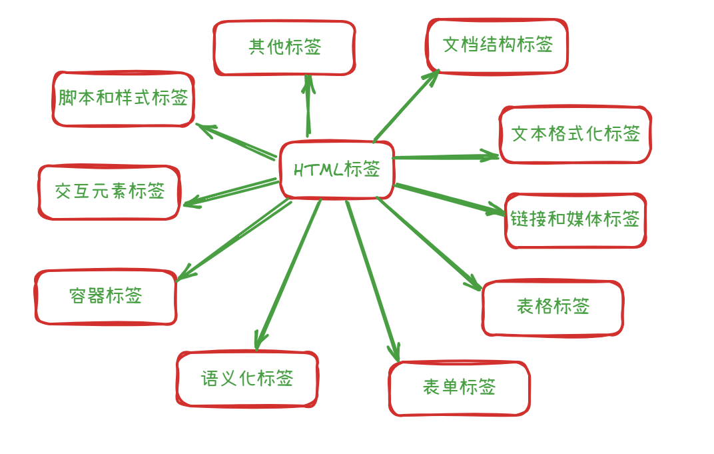

# html 大全



### **1. 文档结构标签**
用于定义网页的基本结构和层次关系。
- **`<html>`**：根标签，包裹整个HTML文档。
- **`<head>`**：包含文档元数据（如字符编码、页面标题、引用资源等）。
- **`<body>`**：包含可见的页面内容（文本、图像、链接等）。
- **`<title>`**：定义浏览器标签页或书签中的页面标题。
- **`<meta>`**：提供关于HTML文档的元数据（如字符编码、关键词、描述）。

### **2. 文本格式化标签**
用于定义文本的结构和格式。
- **标题标签**：`<h1>`~`<h6>`（定义不同级别的标题）。
- **段落标签**：`<p>`（定义段落）。
- **文本样式标签**：
  - `<b>`（粗体）、`<i>`（斜体）、`<u>`（下划线）。
  - `<strong>`（强调重要性）、`<em>`（强调语气）。
  - `<small>`（小号文本）、`<mark>`（高亮文本）。
- **列表标签**：
  - 无序列表：`<ul>` + `<li>`（如项目符号列表）。
  - 有序列表：`<ol>` + `<li>`（如数字列表）。
  - 定义列表：`<dl>` + `<dt>`（术语） + `<dd>`（定义）。

### **3. 链接和媒体标签**
用于嵌入外部资源或创建导航链接。
- **链接标签**：`<a>`（定义超链接）。
  ```html
  <a href="https://example.com">访问网站</a>
  ```
- **图像标签**：``（插入图片）。
  ```html
  
  ```
- **多媒体标签**：
  - `<audio>`（嵌入音频）。
  - `<video>`（嵌入视频）。
  - `<iframe>`（嵌入外部网页）。

### **4. 表格标签**
用于展示结构化数据。
- `<table>`（表格容器）
- `<tr>`（表格行）
- `<th>`（表头单元格）
- `<td>`（表格数据单元格）
- `<caption>`（表格标题）
- `<thead>`、`<tbody>`、`<tfoot>`（表格分区）


### **5. 表单标签**
用于用户输入和数据提交。
- `<form>`（表单容器）
- `<input>`（输入字段，类型包括`text`、`password`、`radio`、`checkbox`等）
- `<select>`（下拉选择框）
- `<textarea>`（多行文本输入）
- `<button>`（按钮）
- `<label>`（为输入元素定义标签）
- `<fieldset>`和`<legend>`（表单分组）

### **6. 语义化标签**
用于明确页面结构和内容含义，提升SEO和可访问性。
- `<header>`（页面或章节的头部）
- `<nav>`（导航链接区域）
- `<main>`（页面主要内容）
- `<article>`（独立内容，如博客文章）
- `<section>`（文档中的章节）
- `<aside>`（侧边栏或辅助内容）
- `<footer>`（页面或章节的底部）

### **7. 容器标签**
用于组织和布局页面元素。
- `<div>`（通用块级容器）
- `<span>`（通用内联容器）
- `<br>`（换行）
- `<hr>`（水平线）
- `<pre>`（保留格式的文本）

### **8. 交互元素标签**
用于创建交互式组件。
- `<details>`和`<summary>`（可折叠内容）
- `<dialog>`（对话框）
- `<progress>`（进度条）
- `<meter>`（刻度值指示器）

### **9. 脚本和样式标签**
用于嵌入或引用外部资源。
- `<script>`（JavaScript代码或引用）
- `<style>`（内联CSS样式）
- `<link>`（引用外部资源，如CSS文件）
- `<meta>`（定义字符编码、页面描述等）

### **10. 其他特殊标签**
- `<canvas>`（用于图形绘制的HTML5元素）
- `<svg>`（可缩放矢量图形）
- `<template>`（HTML模板）
- `<datalist>`（为输入字段提供预定义选项）
- `<keygen>`（生成密钥对）


# 在HTML中创建链接

### **1. 基本链接（外部/内部）**
使用`href`属性指向URL或文件路径。
```html
<!-- 外部链接 -->
<a href="https://www.example.com">访问示例网站</a>

<!-- 内部链接（指向当前网站的其他页面） -->
<a href="/about.html">关于我们</a>

<!-- 相对路径链接 -->
<a href="pages/contact.html">联系我们</a>
```


### **2. 邮件链接**
使用`mailto:`协议创建邮件链接，点击后会打开默认邮件客户端。
```html
<a href="mailto:contact@example.com">发送邮件</a>

<!-- 带主题和正文 -->
<a href="mailto:contact@example.com?subject=咨询&body=您好，我想咨询...">
  发送咨询邮件
</a>
```


### **3. 电话链接**
使用`tel:`协议创建电话链接，点击后会触发拨打电话（移动设备）。
```html
<a href="tel:+86123456789">拨打 +86 123456789</a>
```


### **4. 锚点链接（页面内跳转）**
通过`id`属性定位目标元素，实现页面内的滚动跳转。
```html
<!-- 目标位置 -->
<div id="section1">这是第一部分</div>

<!-- 跳转链接 -->
<a href="#section1">跳转到第一部分</a>
```


### **5. 文件下载链接**
指向文件路径，添加`download`属性强制下载文件。
```html
<a href="/files/report.pdf" download>
  下载报告 (PDF)
</a>
```


### **6. 链接打开方式（target属性）**
使用`target`属性控制链接的打开位置：
- `_blank`：在新窗口或标签页打开。
- `_self`：在当前窗口打开（默认值）。
- `_parent`：在父窗口打开（框架页中使用）。
- `_top`：在顶级窗口打开（框架页中使用）。

```html
<a href="https://example.com" target="_blank">
  在新窗口打开网站
</a>
```


### **7. 链接样式与交互**
使用CSS为链接添加样式（如悬停效果）：
```html
<style>
  a {
    color: #007BFF;
    text-decoration: none;
  }
  a:hover {
    color: #0056b3;
    text-decoration: underline;
  }
</style>

<a href="#">带样式的链接</a>
```


### **8. 禁用链接**
通过JavaScript或CSS使链接暂时不可用：
```html
<!-- 方法1：移除href属性（但仍保持样式） -->
<a onclick="return false;">禁用的链接</a>

<!-- 方法2：添加disabled类并用CSS控制样式 -->
<style>
  .disabled {
    color: gray;
    cursor: not-allowed;
    pointer-events: none;
  }
</style>
<a href="#" class="disabled">禁用的链接</a>
```


### **9. 图片链接**
将图片包裹在`<a>`标签中，使图片成为可点击的链接：
```html
<a href="https://example.com">
  
</a>
```


### **10. 链接辅助属性**
- `title`：鼠标悬停时显示的提示文本。
- `rel`：定义链接与当前文档的关系（如`nofollow`、`noopener`）。

```html
<a href="https://external-site.com" 
   title="外部网站" 
   rel="noopener noreferrer" 
   target="_blank">
  访问外部网站
</a>
```


### **总结**
创建HTML链接的核心是使用`<a>`标签并设置`href`属性。根据需求不同，可以灵活组合其他属性（如`target`、`download`、`title`）实现多样化的链接功能。


# 在html使用img标签

在HTML中，``标签用于嵌入图像。它是一个自闭合标签（单标签），通过`src`属性指定图像的路径，并支持多种属性来控制图像的显示效果和行为。以下是关于``标签的详细用法：


### **1. 基本用法**
使用`src`和`alt`属性插入图像并提供替代文本（图片无法加载时显示）。
```html

```


### **2. 图像路径**
- **绝对路径**：完整的URL（如`https://example.com/image.jpg`）。
- **相对路径**：相对于当前HTML文件的位置（如`./images/pic.jpg`）。

```html
<!-- 绝对路径 -->


<!-- 相对路径 -->

```


### **3. 尺寸控制**
使用`width`和`height`属性（单位：像素或百分比）调整图像大小。
```html
<!-- 固定尺寸 -->


<!-- 响应式尺寸（按比例缩放） -->

```


### **4. 替代文本（`alt`属性）**
为视障用户或图像加载失败时提供文本描述，也是SEO的重要因素。
```html

```


### **5. 图像对齐与布局**
使用CSS（而非过时的`align`属性）控制图像的对齐方式。
```html
<style>
  .center {
    display: block;
    margin: 0 auto;
  }
  .float-right {
    float: right;
    margin-left: 10px;
  }
</style>


```


### **6. 懒加载（`loading`属性）**
浏览器会延迟加载屏幕外的图像，提升页面加载性能。
```html

```


### **7. 图片加载失败处理（`onerror`事件）**
当图片加载失败时，可以使用JavaScript替换为备用图片。
```html

```


### **8. 响应式图片（`srcset`和`sizes`属性）**
根据设备屏幕尺寸和分辨率自动选择合适的图像资源。
```html

```


### **9. 图片格式选择**
根据需求选择合适的图片格式（JPEG、PNG、WebP、SVG等）。
```html
<!-- JPEG（适合照片） -->


<!-- PNG（适合透明图像） -->


<!-- WebP（现代格式，压缩率更高） -->


<!-- SVG（矢量图形，无损缩放） -->

```


### **10. 背景图片替代方案**
对于装饰性图片，可使用CSS的`background-image`属性：
```html
<style>
  .bg-image {
    background-image: url('background.jpg');
    width: 100%;
    height: 300px;
    background-size: cover;
  }
</style>

<div class="bg-image"></div>
```


### **11. 无障碍优化**
- 使用`alt`属性提供有意义的描述。
- 为纯装饰性图片设置`alt=""`以避免屏幕阅读器读取。

```html
<!-- 装饰性图片 -->


<!-- 功能性图片 -->

```


### **12. 安全注意事项**
- 避免从不可信来源加载图片，防止XSS攻击。
- 对于外部图片，使用`referrerpolicy`控制引用来源信息。

```html

```


### **总结**
``标签是HTML中不可或缺的元素，合理使用其属性（如`src`、`alt`、`width`、`loading`）可以优化图片加载性能、提升用户体验和SEO效果。对于现代网站，建议结合响应式设计（`srcset`）和懒加载（`loading="lazy"`）来提升页面性能。