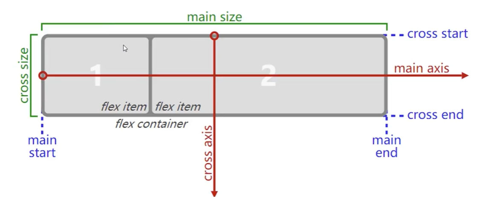

### 一、应用于弹性容器 (Flex Container) 的属性

这些属性设置在父元素上。

1.  **display**

    - **中文名称**: 显示类型

    - **作用**: 定义一个元素为弹性容器。

    - **常用值**:

      - flex: 将元素变为块级弹性容器。
      - inline-flex: 将元素变为行内块级弹性容器。

1.  **flex-direction**

    - **中文名称**: 主轴方向（项目排列方向）

    - **作用**: 定义弹性项目在弹性容器中的排列方向（主轴）。

    - **常用值**:

      - row (默认值): 主轴为水平方向，起点在左端。
      - row-reverse: 主轴为水平方向，起点在右端。
      - column: 主轴为垂直方向，起点在上沿。
      - column-reverse: 主轴为垂直方向，起点在下沿。

1.  **flex-wrap**

    - **中文名称**: 换行方式

    - **作用**: 定义如果一条轴线排不下，如何换行。

    - **常用值**:

      - nowrap (默认值): 不换行，项目会在一行内收缩。
      - wrap: 换行，第一行在上方。
      - wrap-reverse: 换行，第一行在下方。

1.  **flex-flow** (简写属性)

    - **中文名称**: 复合属性 (主轴方向与换行)
    - **作用**: 是 flex-direction 和 flex-wrap 属性的简写形式。
    - **常用值**: `<flex-direction>` || `<flex-wrap>` (例如: row wrap, column nowrap)
    - **默认值**: row nowrap

1.  **justify-content**

    - **中文名称**: 主轴对齐方式

    - **作用**: 定义弹性项目在主轴（flex-direction 定义的方向）上的对齐方式。

    - **常用值**:

      - flex-start (默认值): 项目向主轴起点对齐。
      - flex-end: 项目向主轴终点对齐。
      - center: 项目在主轴上居中对齐。
      - space-between: 项目沿主轴均匀分布，第一个项目在起点，最后一个项目在终点，项目之间的间隔都相等。
      - space-around: 项目沿主轴均匀分布，每个项目两侧的间隔相等。所以，项目之间的间隔比项目与边框的间隔大一倍。
      - space-evenly: 项目沿主轴均匀分布，所有项目之间的间隔以及项目与容器边缘的间隔都相等。

1.  **align-items**

    - **中文名称**: 交叉轴对齐方式（单行）

    - **作用**: 定义弹性项目在交叉轴（与主轴垂直的轴）上如何对齐。

    - **常用值**:

      - stretch (默认值): 如果项目未设置高度或设为 auto，将占满整个容器的高度（或宽度，取决于主轴方向）。
      - flex-start: 项目向交叉轴的起点对齐。
      - flex-end: 项目向交叉轴的终点对齐。
      - center: 项目在交叉轴上居中对齐。
      - baseline: 项目根据它们内容的基线对齐。

1.  **align-content**

    - **中文名称**: 多行内容对齐方式（多行）

    - **作用**: 当弹性容器内有多行弹性项目时（即 flex-wrap 为 wrap 或 wrap-reverse），定义了这些行在交叉轴上的对齐方式。如果只有一行，该属性不起作用。

    - **常用值**:

      - stretch (默认值): 轴线占满整个交叉轴。
      - flex-start: 各行向交叉轴的起点堆放。
      - flex-end: 各行向交叉轴的终点堆放。
      - center: 各行向交叉轴的中点堆放。
      - space-between: 各行在交叉轴上均匀分布，第一行在起点，最后一行在终点。
      - space-around: 各行在交叉轴上均匀分布，每行两侧的间隔相等。
      - space-evenly: 各行在交叉轴上均匀分布，所有行之间的间隔以及行与容器边缘的间隔都相等。

1.  **gap, row-gap, column-gap**

    - **中文名称**: 间距, 行间距, 列间距

    - **作用**: 定义弹性项目之间的间距。gap 是 row-gap 和 column-gap 的简写。

    - **常用值**: `<length>` (例如: 10px, 1em)

    - **示例**:

      - gap: 10px; (行和列间距都是 10px)
      - gap: 10px 20px; (行间距 10px，列间距 20px)
      - row-gap: 10px;
      - column-gap: 20px;

### 二、应用于弹性项目 (Flex Items) 的属性

这些属性设置在子元素上。

1.  **order**

    - **中文名称**: 排列顺序
    - **作用**: 定义弹性项目的排列顺序。数值越小，排列越靠前。
    - **常用值**: `<integer>` (整数，例如 -1, 0, 1)
    - **默认值**: 0

1.  **flex-grow**

    - **中文名称**: 放大比例
    - **作用**: 定义项目的放大比例，默认为 0，即如果存在剩余空间，也不放大。如果所有项目的 flex-grow 属性都为 1，则它们将等分剩余空间。如果一个项目的 flex-grow 属性为 2，其他项目都为 1，则前者占据的剩余空间将比其他项多一倍。
    - **常用值**: `<number>` (非负数)
    - **默认值**: 0

1.  **flex-shrink**

    - **中文名称**: 缩小比例
    - **作用**: 定义项目的缩小比例，默认为 1，即如果空间不足，该项目将缩小。如果所有项目的 flex-shrink 属性都为 1，当空间不足时，都将等比例缩小。如果一个项目的 flex-shrink 属性为 0，其他项目都为 1，则空间不足时，前者不缩小。
    - **常用值**: `<number>` (非负数)
    - **默认值**: 1

1.  **flex-basis**

    - **中文名称**: 项目基本大小
    - **作用**: 定义了在分配多余空间之前，项目占据的主轴空间。浏览器根据这个属性，计算主轴是否有多余空间。它的默认值为 auto，即项目的本来大小。
    - **常用值**: `<length>` | auto (例如: 20%, 100px, auto)
    - **默认值**: auto

1.  **flex** (简写属性)

    - **中文名称**: 复合属性 (放大、缩小与基本大小)

    - **作用**: 是 flex-grow, flex-shrink 和 flex-basis 三个属性的简写。

    - **常用值**:

      - 单个值:

        - `<number>`: 会被当作 flex-grow。例如 flex: 1; (等同于 1 1 0%)
        - `<length>` 或 auto 或 none: 会被当作 flex-basis。例如 flex: auto; (等同于 1 1 auto)

      - 两个值:

        - 第一个是 flex-grow，第二个是 flex-shrink。flex-basis 会是 0%。例如 flex: 1 1; (等同于 1 1 0%)
        - 第一个是 flex-grow，第二个是 flex-basis。flex-shrink 会是 1。例如 flex: 1 50px; (等同于 1 1 50px)

      - 三个值: 分别对应 flex-grow, flex-shrink, flex-basis。例如 flex: 2 1 100px;

    - **推荐的简写值**:

      - flex: 0 0 auto (或 flex: none): 不放大，不缩小，基于内容自动大小。
      - flex: 1 1 auto (或 flex: auto): 可放大，可缩小，基于内容自动大小（这是默认值）。
      - flex: 1 0 auto: 可放大，不缩小，基于内容自动大小。
      - flex: 0 1 auto: 不放大，可缩小，基于内容自动大小。
      - flex: 1 (等同于 flex: 1 1 0%): 项目会等分剩余空间，忽略内容本身大小。
      - flex: 0 (等同于 flex: 0 1 0%): 项目不放大，但会缩小，初始大小为 0，会根据内容撑开。

    - **默认值**: 0 1 auto

1.  **align-self**

    - **中文名称**: 单独项目交叉轴对齐

    - **作用**: 允许单个弹性项目有与其他项目不一样的对齐方式，可覆盖弹性容器的 align-items 属性。

    - **常用值**:

      - auto (默认值): 继承父元素的 align-items 属性。
      - flex-start: 项目向交叉轴的起点对齐。
      - flex-end: 项目向交叉轴的终点对齐。
      - center: 项目在交叉轴上居中对齐。
      - baseline: 项目根据它们内容的基线对齐。
      - stretch: 如果项目未设置高度或设为 auto，将占满整个容器的高度（或宽度）。

---
